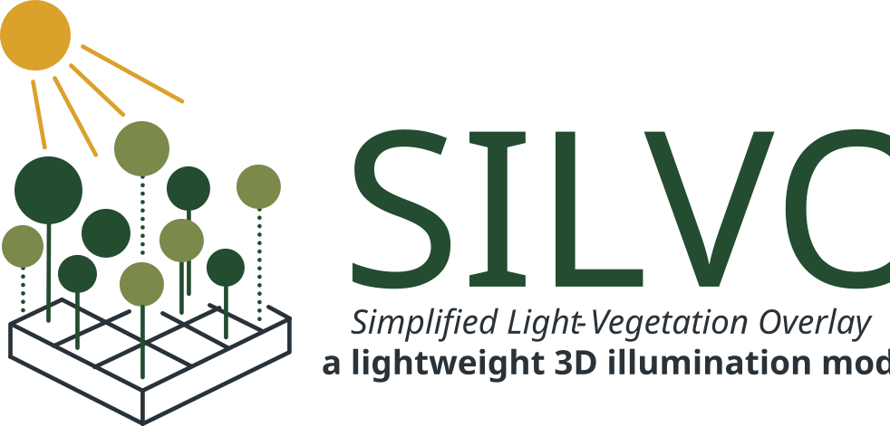
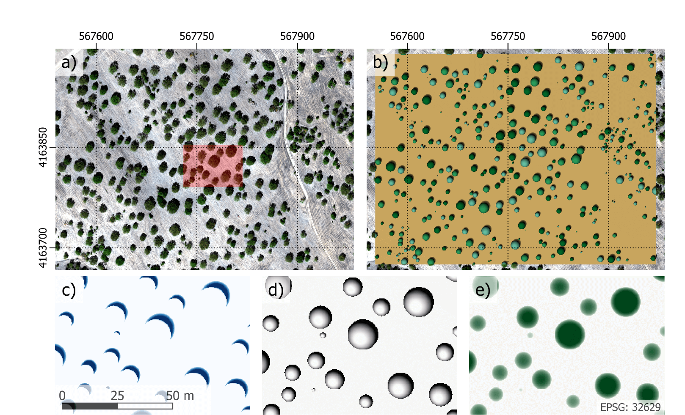
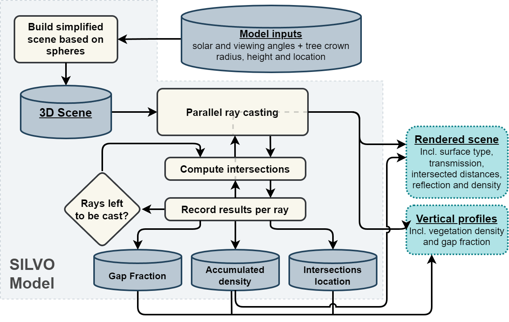
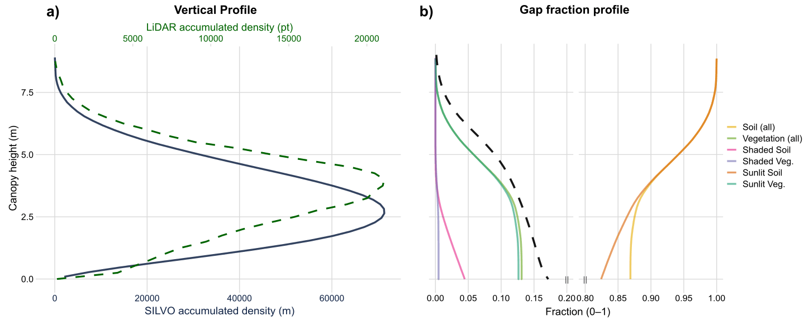

# SILVO — a Simplified Light–Vegetation Overlay model

[](https://doi.org/10.1016/j.jag.2026.105178)
[](LICENSE)




**SILVO** is a lightweight 3D ray-tracing model for **vegetation canopy structure, light interception, gap fraction, and illumination**.
It is designed for heterogeneous canopies such as **orchards, open woodlands, agroforestry systems, and isolated trees** using **minimal inputs**: tree crown position/size plus sun/view geometry.

Keywords: vegetation canopy model, light interception model, gap fraction, tree crown geometry, orchard simulation, agroforestry model, ray tracing.

It is designed to be fast and reproducible, and it is parallelised with **OpenMP**.

## Table of contents

- [What SILVO produces](#what-silvo-produces)
- [Quick start (Linux)](#quick-start-linux)
- [Usage](#usage)
- [Help](#help)
- [Inputs](#inputs)
- [Outputs](#outputs)
- [Changelog](#changelog)
- [How to cite](#how-to-cite)

## What SILVO produces

- **Gap fraction** and sunlit/shaded fractions (soil & vegetation)
- **Vertical structural proxies** (density / profiles) that can constrain 1D RTMs (e.g., SAIL/SCOPE-type workflows)
- A quick-look render (**PPM**; converted to **PNG** in the example scripts) and analysis-ready rasters (**ENVI BIP + HDR**)

## Quick start (Linux)

### 1) Install build tools (Debian-based OS)
```bash
sudo apt update
sudo apt install -y build-essential imagemagick
```
### 2) Clone the repository
```bash
git clone https://github.com/ahornero/silvo.git
cd silvo
```
### 3) Build
From the repository root:
```bash
make
```
The executable is created at (already precompiled in the repo for amd64)
```bash
./bin/silvo
```
To remove outputs generated by the examples and keep the repo clean:
```bash
make clean-examples
```
The general `make clean` target also runs `clean-examples` and removes compiled code and test/render outputs generated in the repository root.
### 4) Run an example
From the repository root:
```bash
./examples/default/run_silvo.sh
```
The available examples are:

- `default` — standard scene with legacy spherical crowns
- `default-spheroids` — standard scene with vertical-spheroid crowns
- `gap-fraction` — spherical crowns with a gap-fraction profile
- `orthographic` — spherical crowns rendered with an orthographic (auto-fitted) camera
- `vertical-profile` — spherical crowns with a vertical profile
- `vertical-profile-spheroids` — vertical-spheroid crowns with a vertical profile

The legacy spherical examples use names without a geometry suffix; vertical-spheroid variants use `-spheroids`.

Each script writes its outputs in its own example directory. All examples generate `output_image.png`, `output.bip`, and `output.hdr`; profile examples also generate `vertical_profile.csv` or `gap_fraction_profile.csv`. SILVO first writes `output_image.ppm`, which the scripts convert to PNG with ImageMagick and then remove.



## Usage

By default, SILVO reads the following files from the current working directory:
- scene.txt
- settings.txt

But they can be chosen from the command line as arguments:
```bash
./bin/silvo --scene path/to/scene.txt --config path/to/settings.txt
```
Same applies for the solar and camera settings. Command-line values take precedence over settings.txt:
```bash
./bin/silvo --scene scene.txt --config settings.txt \
  --sza 35 --saa 120 --cza 0 --caa 0 --cds 600 --fov 30
```
## Help
```bash
./bin/silvo -h
Usage: ./bin/silvo
        [-s|--scene scene_file (scene.txt)]
        [-c|--config config_file (settings.txt)]
        [--sza value] [--saa value] [--cza value] [--caa value] [--cds value] [--fov value] [--csize value] [--cmargin value]

        [-h] (show this)
```
- `--sza`, `--saa` — solar zenith/azimuth angle (degrees).
- `--cza`, `--caa` — camera zenith/azimuth angle (degrees).
- `--cds` — camera distance from the origin. In orthographic mode it only needs to stay beyond the tallest crown along the view axis; it no longer controls the visible footprint.
- `--fov` — vertical field of view (degrees), perspective mode only; ignored in orthographic mode.
- `--csize` — orthographic half-height, in scene units; `0` or omitted aut(defoult) a-fits all vegetation. Orthographic mode only.
-  `--cmargin` — auto-fit margin fraction (e.g. `0.01` = 1%), ; default orthographic mode only.

A few flags are settings.txt-only (not available as CLI arguments), see below.
## Inputs
### _scene.txt_ (vegetation crowns)
Plain text. Each non-comment (#...) line contains either:
```text
x  y  z  radius
```
or
```text
x  y  z  horizontalRadius  verticalRadius
```
- Lines starting with # are ignored.
- If `verticalRadius` is omitted, the object is treated as a sphere.
- `z` is the base height of the crown; SILVO places the crown centre at `z + verticalRadius`.
- `verticalRadius < horizontalRadius` gives a flattened crown, while `verticalRadius > horizontalRadius` gives an elongated one.
- This release introduces support for vertical spheroids while preserving backward compatibility with legacy 4-column scene files.
Example:
```text
# x   y   z   horizontalRadius   verticalRadius
0.0  0.0  0.0  2.5  2.5
8.0  0.0  0.0  2.0
0.0  8.0  0.0  3.0  4.0
```
Legacy (just spheres) 4-column entries remain fully supported, so older `scene.txt` files still work without modification.
### _settings.txt_ (camera + sun + flags)
Plain text key/value pairs, e.g.:
```text
solar_zenith = 35
solar_azimuth = 120

camera_zenith = 0
camera_azimuth = 0

# These two paramaters are ignored in orthographic mode

amera_distance = 600
camera_fov = 30

# These two parameters are ignored in perspective mode
camera_size = 0         # Orthographic half-height, in metres; 0 (or omitted) auto-fits all vegetation
camera_margin = 0.05    # 0.01; 1% by default

# Following flags are settings.txt-only, no CLI equivalent
debug = 0
gap_fraction_profile_enabled = 0

# Orthographic projection
camera_projection = 0   # 0 (perspective, default), 1 (orthographic)
camera_fill = 0         # 0 (contain, default), 1 = zoom to fill
```
All numeric camera/solar keys (`camera_zenith`, `camera_azimuth`, `camera_distance`, `camera_fov`, `camera_size`, `camera_margin`, `solar_zenith`, `solar_azimuth`) can also be overridden from the command line (see [Help](#help)); command-line values always win over settings.txt.

Following flags are settings.txt-only and cannot be set from the command line:
- `camera_projection` — `0` perspective (default) or `1` orthographic.
- `camera_fill` — orthographic auto-fit mode: `0` *contain* (default, whole scene visible, may leave a margin on one axis) or `1` *fill* (zooms in to remove empty margins, cropping the longer axis).
- `gap_fraction_profile_enabled` and `debug` are also settings.txt-only, as documented above.
## Outputs

SILVO writes outputs to the current working directory:

- _output_image.ppm_ — RGB quick-look render
- _output.bip_ + _output.hdr_ — ENVI BIP (15 bands, float32) + header
- Console metrics (stdout): gap fraction, sunlit/shaded fractions, normalised density
- Optional CSV profiles:
    - _vertical_profile.csv_ (generated when camera_zenith == 90)
    - _gap_fraction_profile.csv_ (generated when gap_fraction_profile_enabled = 1 and camera_zenith != 90)

When you use a `run_silvo.sh` example, the script converts _output_image.ppm_ to _output_image.png_ and removes the intermediate PPM file.

## Changelog

See [CHANGELOG.md](CHANGELOG.md) for the project history and recent changes.

## How to cite

If you use SILVO in academic work, please cite:

```text
Hornero, A., Prikaziuk, E., Hernandez-Clemente, R., van der Tol, C. (2026).
SILVO, a lightweight 3D illumination model to characterise the spatial structure of heterogeneous vegetation canopies.
International Journal of Applied Earth Observation and Geoinformation, 147, 105178. https://doi.org/10.1016/j.jag.2026.105178
```
```bibtex
@article{Hornero2026SILVO,
  title   = {SILVO, a lightweight 3D illumination model to characterise the spatial structure of heterogeneous vegetation canopies},
  author  = {Hornero, A. and Prikaziuk, E. and Hernandez-Clemente, R. and van der Tol, C.},
  journal = {International Journal of Applied Earth Observation and Geoinformation},
  volume  = {147},
  pages   = {105178},
  year    = {2026},
  issn    = {1569-8432},
  doi     = {10.1016/j.jag.2026.105178},
  url     = {https://doi.org/10.1016/j.jag.2026.105178}
}
```
